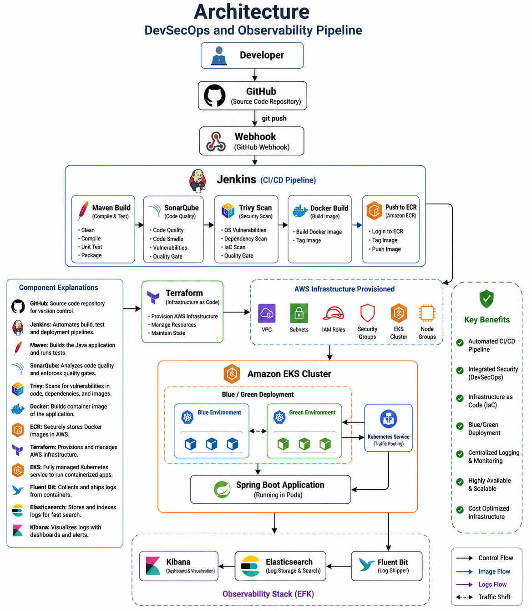

# 🚀 Enterprise Product Deployment Platform

An end-to-end **Enterprise DevSecOps and Observability Platform** built on **AWS** that automates infrastructure provisioning, CI/CD, security scanning, Kubernetes deployment, centralized logging, monitoring, and production-grade deployment strategies.

---

# 📌 Project Overview

This project demonstrates a complete DevOps lifecycle for deploying a Spring Boot application using Infrastructure as Code (Terraform), CI/CD (Jenkins), containerization (Docker), Kubernetes (Amazon EKS), centralized logging (EFK Stack), and security scanning (SonarQube & Trivy).

The platform follows modern DevSecOps practices by integrating automated testing, vulnerability scanning, infrastructure provisioning, monitoring, and Blue/Green deployments.

---

# 🏗 Architecture



---

# 🛠 Technology Stack

| Category | Technology |
|-----------|------------|
| Cloud | AWS |
| Infrastructure as Code | Terraform |
| Source Control | GitHub |
| CI/CD | Jenkins |
| Build Tool | Maven |
| Static Code Analysis | SonarQube |
| Security Scan | Trivy |
| Containerization | Docker |
| Container Registry | Amazon ECR |
| Orchestration | Amazon EKS |
| Monitoring | Fluent Bit + Elasticsearch + Kibana |
| Application | Spring Boot |

---

# 📂 Repository Structure

```
enterprise-product-deployment/
│
├── app/
├── terraform/
├── kubernetes/
├── monitoring/
├── jenkins/
├── Docs/
├── Failure & Incident Simulation/
├── screenshots/
├── Jenkinsfile
├── Architecture.png
└── README.md
```

---

# 🚀 Project Workflow

```
Developer
     │
GitHub Repository
     │
GitHub Webhook
     │
Jenkins Pipeline
     │
Maven Build
     │
SonarQube Analysis
     │
Trivy Security Scan
     │
Docker Build
     │
Amazon ECR
     │
Terraform
     │
Amazon EKS
     │
Spring Boot Application
     │
Fluent Bit
     │
Elasticsearch
     │
Kibana
```

---

# 🔄 CI/CD Pipeline

- Source Checkout
- Maven Build
- Unit Testing
- SonarQube Analysis
- Trivy Scan
- Docker Image Build
- Push Image to Amazon ECR
- Terraform Apply
- Kubernetes Deployment
- Deployment Verification

---

# ☸ Kubernetes Features

- Amazon EKS
- Blue/Green Deployment
- Namespace Isolation
- Services
- Deployments
- Health Checks
- Rolling Updates

---

# 🔐 Security

- IAM Least Privilege
- AWS Secrets Manager
- SonarQube Code Analysis
- Trivy Image Scanning
- Security Groups
- MFA

---

# 📊 Monitoring

- Fluent Bit
- Elasticsearch
- Kibana Dashboards
- CloudWatch
- Jenkins Logs
- Kubernetes Logs

---

# 💰 Cost Optimization

- Spot Instances
- Kubernetes Autoscaling
- Resource Optimization
- Trusted Advisor Review

---

# 🛡 Disaster Recovery

- Blue/Green Deployment
- Backup Verification
- RTO/RPO Documentation
- Failure Simulation
- Incident Response

---

# 📷 Screenshots

The repository includes screenshots demonstrating:

- Jenkins Pipelines
- SonarQube Dashboard
- Trivy Scan
- Terraform Deployment
- Amazon EKS
- Blue/Green Deployment
- Kibana Dashboards
- Trusted Advisor
- Dynamic Secrets
- Monitoring Dashboards

---

# 📖 Documentation

Complete project documentation is available in the **Docs** folder, including:

- Backup Verification
- RTO/RPO
- Cost Optimization
- Incident Simulation
- Production Expectations
- Runbook
- Architecture Documentation

---

# 👨‍💻 Author

**Ravi Teja**

AWS | DevOps | Terraform | Kubernetes | Jenkins | Docker | Spring Boot
